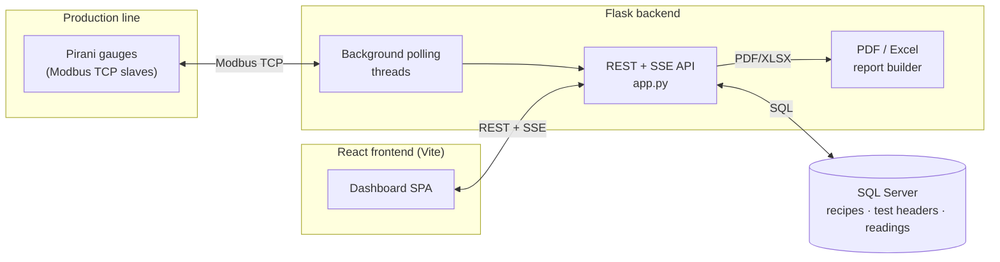

# WRL Pirani Gauge Dashboard

A real-time production-floor dashboard for testing and monitoring **Pirani vacuum gauges** on a manufacturing line — built to replace a manual, paper-based QC process with a live Modbus-driven web app.

Operators start a test on a fixture, the backend polls the gauge over Modbus TCP at a configurable interval, results are logged to SQL Server, and engineers can pull pass/fail reports — complete with every individual reading and a one-click PDF export — without ever touching the floor PC.

---
## 📸 Application Screenshots

<table align="center">
  <tr>
    <td align="center">
      <strong>Live Floor Monitoring</strong><br><br>
        
    </td>
    <td align="center">
      <strong>Recipe Management</strong><br><br>
      
    </td>
  </tr>
  <tr>
    <td colspan="2" align="center">
      <br>
      <strong>Reports Dashboard</strong><br><br>
      
    </td>
  </tr>
</table>

## ✨ Features

**Live floor view**

- Real-time fixture/conveyor visualization over Server-Sent Events (SSE), with automatic fallback to polling if the stream drops
- Per-line gauge layout (configurable gauge count per production line)
- Start / stop a test on any gauge directly from the UI
- Live vacuum reading chart per fixture, today's pass/fail counters, and a rolling table of the last completed tests

**Recipe management**

- CRUD for test recipes (model code, lower/upper vacuum limits, test duration, poll interval)
- Clone-from-existing recipe to speed up onboarding a new model

**Reporting**

- Filterable report search (date range, model, line, gauge, result)
- Inline accordion per row — expand any test to see its full trend chart _and_ every single poll-interval reading logged during that run, no separate page load
- One-click **Excel export** of the filtered result set
- One-click **PDF export** per test — header info, min/max/avg stats, and the complete readings log, generated server-side
- Live Modbus diagnostics endpoint for troubleshooting gateway connectivity

**Operator-friendly login**

- Tap-to-login screen (no typing on a shop-floor touchscreen) with a line picker, so the dashboard always knows the gauge count for the active line

---

## 🏗️ Architecture



In production, the React build is served as static files by the same Flask process — one process, one port, no extra web server required (see [`client/README.md`](client/README.md)).

---

## 🧰 Tech stack

| Layer               | Technology                                                            |
| ------------------- | --------------------------------------------------------------------- |
| Frontend            | React 19, Vite, Redux Toolkit, Tailwind CSS v4, Recharts, react-icons |
| Backend             | Python, Flask, threading-based Modbus poller                          |
| Industrial protocol | Modbus TCP (`pymodbus`)                                               |
| Database            | Microsoft SQL Server (`pyodbc`)                                       |
| Reporting           | `pandas` (Excel export), `reportlab` (PDF generation)                 |
| Testing             | `pytest`                                                              |
| Linting             | `oxlint`                                                              |

---

## 📁 Project structure

```
WRL-Pirani-Gauge-Dashboard/
├── app.py                  # Flask API: recipes, tests, fixtures/SSE, reports, PDF/Excel export
├── config.py                # Modbus gateway config (env-driven)
├── db.py                    # SQL Server connection + queries (env-driven)
├── test_runner.py           # Test lifecycle: start/stop/poll a gauge, write readings
├── modbus_test.py           # Standalone CLI tool to scan/diagnose Modbus registers
├── requirements.txt
├── .env.example              # Copy to .env and fill in real credentials
├── tests/
│   └── test_app.py          # pytest suite for the Flask API
└── client/                  # React frontend (Vite)
    ├── src/
    │   ├── api/client.js     # Thin fetch wrapper around the Flask API
    │   ├── pages/            # FixturesPage, RecipesPage, ReportsPage, LoginPage
    │   ├── components/       # ConveyorTrack, ReportTable, ReportAccordion, RecipeTable, ...
    │   ├── store/            # Redux auth slice
    │   └── config/           # Production line + operator login config
    └── README.md             # Frontend-specific docs (dev/build/production serving)
```

---

## 🚀 Getting started

### Prerequisites

- Python 3.10+
- Node.js 18+
- SQL Server reachable from the backend host
- A Modbus TCP gateway/gauge reachable from the backend host (or run with `DISABLE_WORKERS=1` to develop without hardware)

### Backend

```bash
pip install -r requirements.txt
cp .env.example .env        # fill in DB_PASSWORD and your real Modbus/DB hosts
python app.py                # serves the API on http://localhost:5000
```

### Frontend

```bash
cd client
npm install
npm run dev                  # http://localhost:5173, proxies /api to localhost:5000
```

### Running tests

```bash
DISABLE_WORKERS=1 pytest tests/
```

### Production build

```bash
cd client && npm run build   # outputs client/dist
cd .. && python app.py        # now also serves the React build on the same port
```

---

## 🔌 API reference

| Method     | Route                          | Description                                          |
| ---------- | ------------------------------ | ---------------------------------------------------- |
| GET        | `/api/health`                  | Gateway/poller health check                          |
| GET        | `/api/stats/today`             | Today's pass/fail counters                           |
| GET        | `/api/recipe/<model_code>`     | Fetch a single recipe                                |
| GET / POST | `/api/recipes`                 | List recipes / create or update (upsert) a recipe    |
| DELETE     | `/api/recipes/<model_code>`    | Delete a recipe                                      |
| POST       | `/start-test`                  | Start a test on a gauge                              |
| POST       | `/stop-test/<gauge_id>`        | Stop a running test                                  |
| GET        | `/api/active-tests`            | Currently running tests                              |
| GET        | `/api/fixtures`                | Snapshot of all fixture states                       |
| GET        | `/api/fixtures/stream`         | SSE stream of live fixture state                     |
| GET        | `/api/fixture-live/<slave_id>` | Live vacuum reading for one fixture                  |
| GET        | `/api/fixture/<slave_id>`      | Fixture detail                                       |
| GET        | `/api/modbus/diagnostics`      | Modbus gateway diagnostics                           |
| GET        | `/api/reports`                 | Filterable report search (`?export=excel` for Excel) |
| GET        | `/api/report/<test_id>/trend`  | Every poll reading for one test                      |
| GET        | `/api/report/<test_id>/pdf`    | Download a PDF report for one test                   |

---

## 🔐 Configuration

All secrets and host addresses are environment-driven via `.env` (see `.env.example`) — nothing is hardcoded in source:

| Variable                                         | Purpose                                                                                                         |
| ------------------------------------------------ | --------------------------------------------------------------------------------------------------------------- |
| `DB_SERVER`, `DB_NAME`, `DB_USER`, `DB_PASSWORD` | SQL Server connection                                                                                           |
| `MODBUS_HOST`, `MODBUS_PORT`                     | Modbus TCP gateway                                                                                              |
| `DISABLE_WORKERS`                                | Set to `1` to skip starting the background Modbus polling threads (useful for local dev/tests without hardware) |

---

## 🗺️ Possible next steps

- Code-split the frontend bundle (currently a single ~675 KB chunk)
- Role-based auth checked against the backend instead of a hardcoded frontend credential list
- WebSocket upgrade for the live fixture stream

---

## 📄 License

This project is provided as-is for internal/educational use. Add a license of your choice before distributing publicly.
